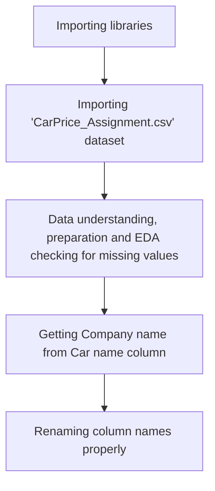

# Car Price Prediction Model Diagrams

Generated on 2026-04-26T04:17:39Z from repository evidence.

## Architecture Overview

```mermaid
flowchart LR
    A[Repository Inputs] --> B[Preparation and Validation]
    B --> C[ML Case Study Core Logic]
    C --> D[Output Surface]
    D --> E[Insights or Actions]
```

## Workflow Sequence

```mermaid
flowchart TD
    S1["Importing libraries"]
    S2["Importing 'CarPrice_Assignment.csv' dataset"]
    S1 --> S2
    S3["Data understanding, preparation and EDA checking for missing values"]
    S2 --> S3
    S4["Getting Company name from Car name column"]
    S3 --> S4
    S5["Renaming column names properly"]
    S4 --> S5
```
